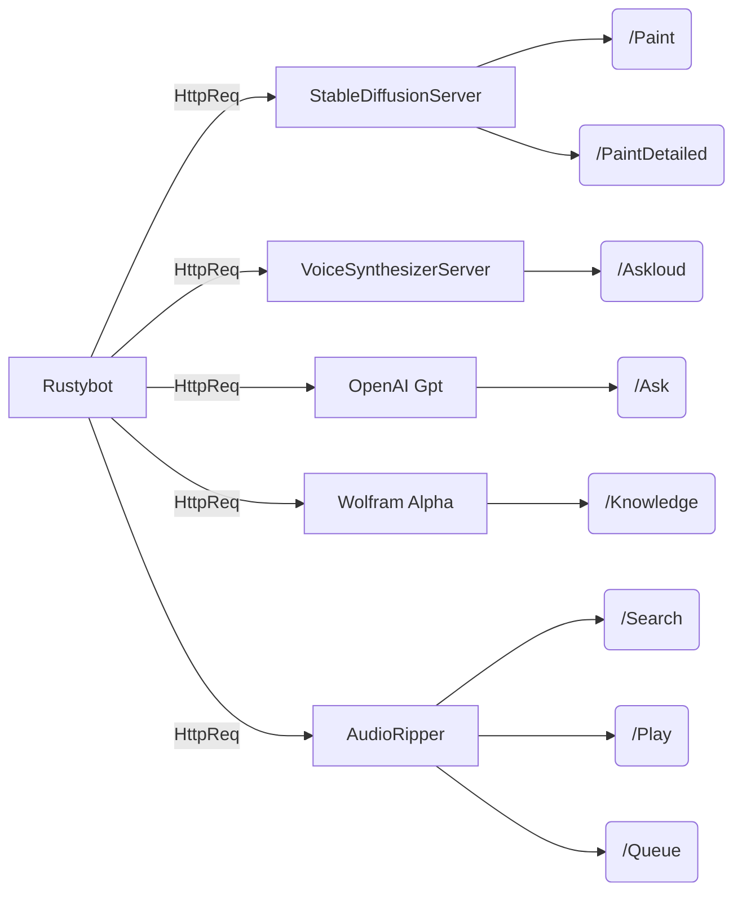

# Rustybot 

A lil rusty bot. That streams music.... and other stuff

## FEATURES:

* Stream music from youtube

* Get facts / knowledge from Wolfram Alpha

* Ask GPT3.5 a question, and hear them speak in voice!

* Generate 512x512 images from Spatial-Diffuse1.5

* Voice activated commands from mic streaming

* Text to voice synthesizer AI

> `Warning: Safety check for image generation is disabled`
    > `The safety check takes insane amount of gpu vram, so beware.`





## stable_diffusion_server - generate images with spatial-diffuse-1.5

* stablediffuse-generator -> imggenerator

* checkforcuda -> check for cuda

  

## voicesyntheizeauthserver
* google authentication node server for text to speech synthesizer
## audiototext/mic2stream_server
* server to stream audio
## audiototext/stream2audio_command_client
* connects to mic2stream_server and grabs the audio, creating a specific audio copy to transcibe
## audiototext/transcribe_ai_server
* converts the audio in to text

  

-------------------------------------------------------------------------------------------------------------------

## Reminders:
cargo build the bot
npm install the auth server
(setup google credential using gcloud. 
``**WARNING** GLOUD AUTH ERROR -> USE EDGE NOT FIREFOX )``
pip install python stuff, needs python3.9 or above for some things

-------------------------------------------------------------------------------------------------------------------

  

**`CUDA - Tensorflow - if using windows, you MUST use WSL2. Running tensorflow on windows with gpu is unavailable.`**

## Check out these resouces:

|Installation: https://docs.nvidia.com/deeplearning/cudnn/install-guide/index.html|  |
|---------------------------------------------------------------------------------|--|
|                                                                                 |  |

|Cuda Linux->WSL: https://developer.nvidia.com/cuda-toolkit-archive|  |
|------------------------------------------------------------------|--|
|                                                                  |  |

|check this for support matrix: https://docs.nvidia.com/deeplearning/cudnn/support-matrix/index.html#cudnn-cuda-hardware-versions|  |
|--------------------------------------------------------------------------------------------------------------------------------|--|

## WSL2
ENABLE WINDOWS SUBSYSTEM , and VIRTUAL WINDOWS
Make sure its using wsl2, upgrade if you need to

**powershell cli**
```powershell
wsl -l -v
wsl --set-version [distro] [wslversion]
```
  

## Just use Conda
...With python tensorflow gpu build.... much less of a headache
```bash
conda install -c conda-forge cudatoolkit=11.8.0

python3 -m pip install nvidia-cudnn-cu11==8.6.0.163 tensorflow==2.12.*

mkdir -p $CONDA_PREFIX/etc/conda/activate.d

echo 'CUDNN_PATH=$(dirname $(python -c "import nvidia.cudnn;print(nvidia.cudnn.__file__)"))' >> $CONDA_PREFIX/etc/conda/activate.d/env_vars.sh

echo 'export LD_LIBRARY_PATH=$LD_LIBRARY_PATH:$CONDA_PREFIX/lib/:$CUDNN_PATH/lib' >> $CONDA_PREFIX/etc/conda/activate.d/env_vars.sh

source $CONDA_PREFIX/etc/conda/activate.d/env_vars.sh
```
## Verify install
```python
# Verify install:

python3 -c "import tensorflow as tf; print(tf.config.list_physical_devices('GPU'))"
```
  
  

## Other repos to checkout:
diffusers - https://github.com/huggingface/diffusers
serenity - https://github.com/serenity-rs/serenity
songbird - https://github.com/serenity-rs/songbird
yt-dlp - https://github.com/yt-dlp/yt-dlp.


